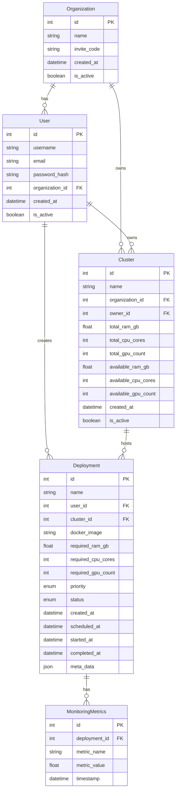

# MLOps Platform

A hypervisor-like service for managing ML deployments with intelligent scheduling.

## Features

- User authentication and organization management
- Cluster resource management
- Intelligent deployment scheduling with priority-based preemption
- Real-time monitoring and metrics
- Docker container deployment support

## Prerequisites

- Python 3.11+
- Docker and Docker Compose
- PostgreSQL 15
- Redis 7

## Setup

1. Clone the repository:

```bash
git clone <repository-url>
cd MLOpsService
```

2. Create and activate a virtual environment:

```bash
python -m venv venv
source venv/bin/activate
```

3. Install dependencies:

```bash
pip install -r requirements.txt
```

4. Start the services using Docker Compose:

```bash
docker-compose up -d
```

## API Endpoints

### Authentication

- POST `/auth/register` - Register a new user
- POST `/auth/login` - Login and get access token

### Organizations

- POST `/organizations` - Create a new organization
- GET `/organizations/me` - Get current user's organization

### Clusters

- POST `/clusters` - Create a new cluster
- GET `/clusters` - List available clusters

### Deployments

- POST `/deployments` - Create a new deployment
- GET `/deployments` - List user's deployments
- GET `/deployments/{id}` - Get deployment details
- DELETE `/deployments/{id}` - Cancel a deployment

### Monitoring

- GET `/monitoring/health` - Health check endpoint
- GET `/monitoring/metrics` - Get system metrics

## Development

### Project Structure

```
app/
├── api/
│   ├── endpoints/
│   │   ├── auth.py
│   │   ├── clusters.py
│   │   ├── deployments.py
│   │   ├── monitoring.py
│   │   └── organizations.py
│   └── deps.py
├── core/
│   ├── config.py
│   ├── enums.py
│   └── security.py
├── db/
│   └── base.py
├── models/
│   ├── user.py
│   ├── organization.py
│   ├── cluster.py
│   └── deployment.py
├── schemas/
│   ├── user.py
│   ├── organization.py
│   ├── cluster.py
│   └── deployment.py
├── services/
│   └── scheduler.py
├── utils/
│   └── invite.py
└── main.py
```

# Database Schema



### Running Tests

```bash
pytest
```

## License

MIT License
